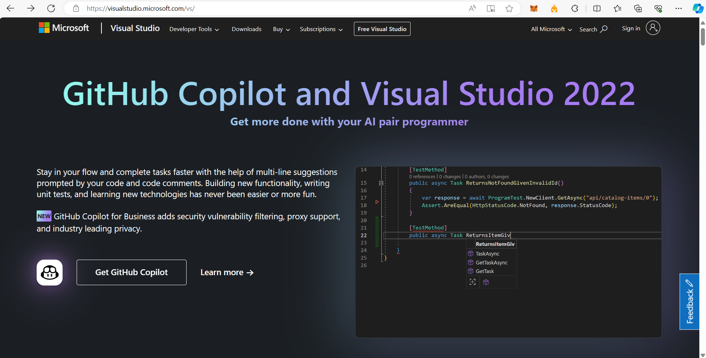
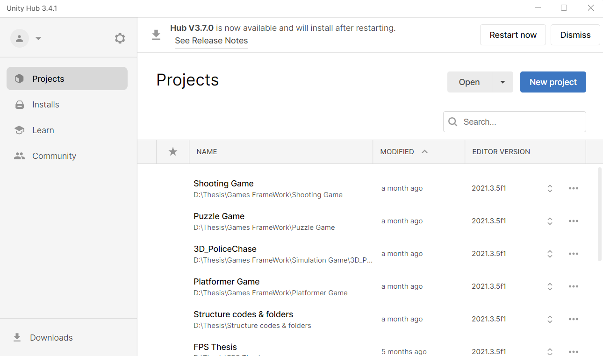
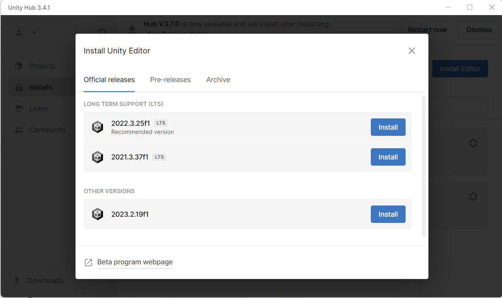
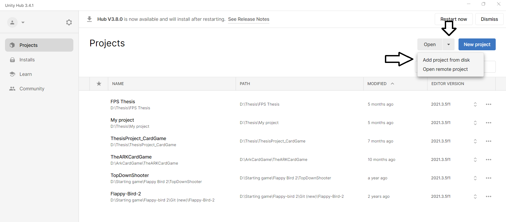
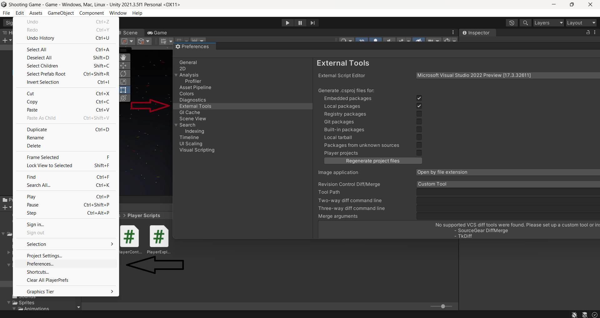
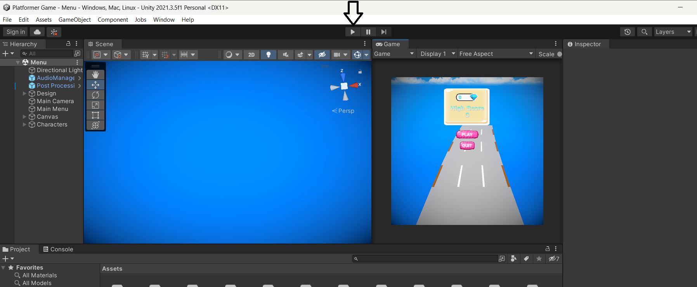
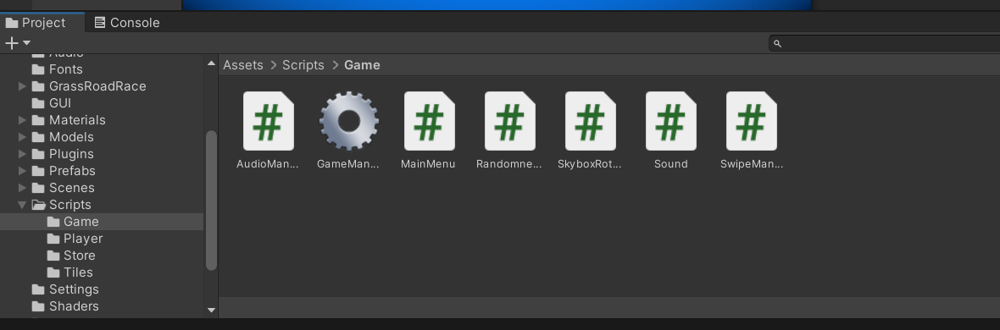

<h1 align="center"> A RESEARCH FOR IMPLEMENTATION OF THE GAME FRAMEWORK ON UNITY 3D </h1>

<h2 align="center">By Hoang Trung Phong</h2>

## Getting Started

## 1. Installation

**Two separate programs must be installed: VS Studio and Unity**

1. **Visual Studio** 
   * Download and install Microsoft Visual Studio: <a href="https://visualstudio.microsoft.com/" target="_blank">https://visualstudio.microsoft.com/</a>

2. **Unity**
   * Download and install Unity Hub from: <a href="https://store.unity.com/download-nuo" target="_blank">https://store.unity.com/download-nuo</a>
   * Open Unity Hub
   
   
   
   * On the left-hand menu, select `Installs` then click on the blue `Install Editor` button on the right,find and choose the 2021.3.5f1 version and click on `Install`

   

--------------------------------------------------------------------------------------------------

## 2. Open Unity Project

* On the left-hand menu, select `Projects` then click the arrow next to the grey `Open` button on the right, and choose `Add project from disk`and cho the file.

* After your project is opened, you will be presented with the working environment

**We must configure Unity use VS Studio as the external code editor**

* Go to menu item `Edit` → `Preferences...` → `External Tools`
* Change `External Script Editor` to option VS Studio.

To run the project , at the working environment, chose the play icon at the top of the screen 

To check and work with the code , double click to any script file(The script file will always stay at the Script folder) 

